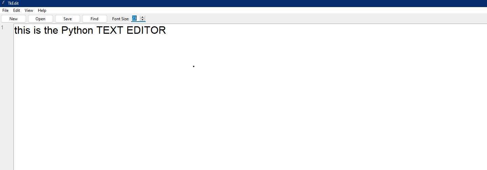

# Modern Tkinter Text Editor  

[](https://www.python.org/)  
[](#)  
[](LICENSE)  

---

## What is this project?  

This is a **modern text editor** built in Python using the **Tkinter** GUI toolkit.  
It includes all the **basic editing features** you’d expect (new, open, save, cut, copy, paste) plus some **quality-of-life improvements** like:  

- Theme switching (Light/Dark)  
- Auto-save functionality  
- Font customization  
- Syntax highlighting (basic for now)  
- Clean, modular code structure  

---

## Why this project?  

This project was created **purely for learning purposes** —  
to understand **GUI development in Python**, how to structure **multi-file projects**,  
and how to keep code **clean and maintainable** using a modular approach.  

It’s **not meant to compete** with advanced editors like VS Code or Sublime,  
but to serve as an **educational step** toward building complex desktop apps.

---

## How does it work?  

1. **Launch the App**  
   ```bash
   python main.py
   ```
2. **Main Window** opens with:
   - Menu Bar (File, Edit, View, Tools, Help)  
   - Text Area for editing text  
   - Status Bar showing cursor position  

3. **Key Features in Action**  
   - **File Menu** → Create, open, save, and save-as text files.  
   - **Edit Menu** → Undo, redo, cut, copy, paste.  
   - **View Menu** → Change theme between Light & Dark.  
   - **Tools** → Auto-save runs in the background and saves temp files periodically.  

4. **Configuration**  
   - Settings like font size, theme, and window size are saved in `config/settings.json`.  

---

## Project Structure  

```plaintext
text_editor/
│
├── main.py                  # Entry point of the application
│
├── ui/
│   ├── main_window.py        # Builds main Tkinter window
│   ├── menu_bar.py           # Menu bar UI
│   ├── text_area.py          # Text editing widget
│   ├── status_bar.py         # Status bar
│   └── __init__.py
│
├── features/
│   ├── file_ops.py           # New, open, save, save-as
│   ├── edit_ops.py           # Cut, copy, paste, undo, redo
│   ├── view_ops.py           # Zoom, theme switching
│   ├── find_replace.py       # Search and replace text
│   ├── syntax_highlight.py   # Basic syntax highlighting
│   └── __init__.py
│
├── utils/
│   ├── helpers.py            # Helper functions
│   ├── config.py             # Load/save settings
│   ├── constants.py          # App constants
│   ├── auto_save.py          # Auto-save logic
│   └── __init__.py
│
├── config/
│   └── settings.json         # Default user settings
│
├── tests/
│   └── test_basic.py         # Basic tests
│
└── README.md                 # Project documentation
```

---

## Getting Started  

**1️⃣ Clone this repository**  
```bash
git clone https://github.com/AliOding12/python-text-editor.git
cd python-text-editor
```

**2️⃣ Install Python**  
Make sure Python 3.10+ is installed. [Download here](https://www.python.org/downloads/).

**3️⃣ Run the editor**  
```bash
python main.py
```

---

## Screenshots  

 
 

---

## License  

This project is licensed under the **MIT License** — see the [LICENSE](LICENSE) file for details.  

---

Built with ❤️ in Python and Tkinter  By AliOding12
<!-- Initial commit: Set up project with README and .gitignore -->
